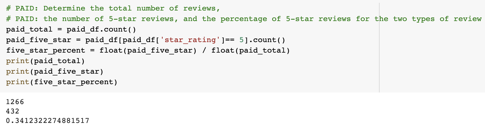
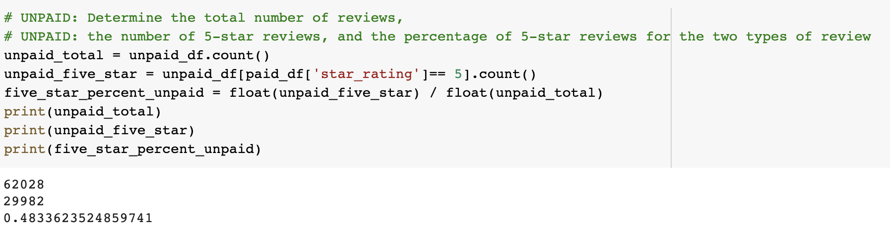

# Amazon_Vine_Analysis
## Overview of the analysis
In this project, I will be using Google Colab Notebook to analyze Amazon reviews written by members of the paid Amazon Vine program. The Amazon Vine program allows manufacturers and publishers to receive reviews of their products. In this project, I choose to analysis toys’ reviews dataset retrieves from https://s3.amazonaws.com/amazon-reviews-pds/tsv/amazon_reviews_us_Toys_v1_00.tsv.gz to form the analysis. The dataset’s columns I will be using are: customer_id, customer_count, review_id, product_id, product_title, product_parent, review_date, star_rating, helpful_votes, total_votes, vine, and verified_purchase. I will be using PySpark to perform the ETL process and connect to an AWS RDS instance. In addition, my further analysis will be focusing on determining if there is any bias toward favorable reviews from Vine members in the toys dataset.
## Results
- There are 1,266 Vine reviews, and 62,028 non_Vine reviews
- There are 432 Vine reviews were 5 stars, and 29,982 non-Vine reviews were 5 stars
- 34.12% of Vine reviews were 5 star, and 48.33% of non_Vine reviews were 5 stars
Please see Figure 1 and Figure 2 for code and details:
  
  Figure 1: Paid—Total Reviews, Total 5 Star Reviews, Percentage of 5 Star Vine Reviews
  
  Figure 2: Unpaid—Total Reviews, Total 5 Star Reviews, Percentage of 5 Star Non-Vine Reviews
## Summary
I would say that Vine reviewers may have some bias based on my analysis, in favor of the products they review due to the fact that they are non-Vine reviewers and they received for free. First of all, Amazon Vine is the honest feedback from reviewers based on the selected reviewers. The total Vine reviews is only 2% (1,266/62,028) of the non-Vine reviews, but the percentage of non-Vine reviews that were 5 stars is 14.21% more than the percentage of vine reviews (48.33%-34.12%). Since the non-Vine reviews have a large sample size than the Vine reviews, should the non-Vine reviews be more reliable and unbiased? Or should we trust the selected Vine reviews to represent the real feedback of the toys? In my opinion, both have pros and cons. The non-Vine reviewers could have fake comment by sellers, and the Vine reviewers that are selected could be bias. Therefore, the analysis may have some bias. I would have a pie chart of the star_rating to have an overlook of the percentage of each star. We only focus on the 5 star reviews in this analysis, it would be great to look at the percentage of each star. Also, we should use PySpark and Natural Language Processing for the review headline and review body to see the most important comment for the product. If we add these two suggestions to this analysis, the analysis should be less biased.